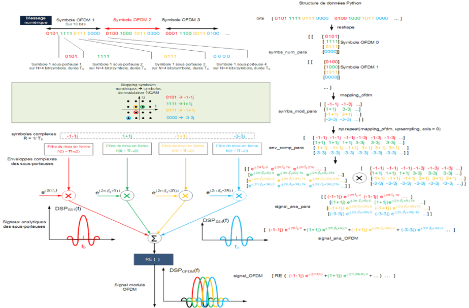
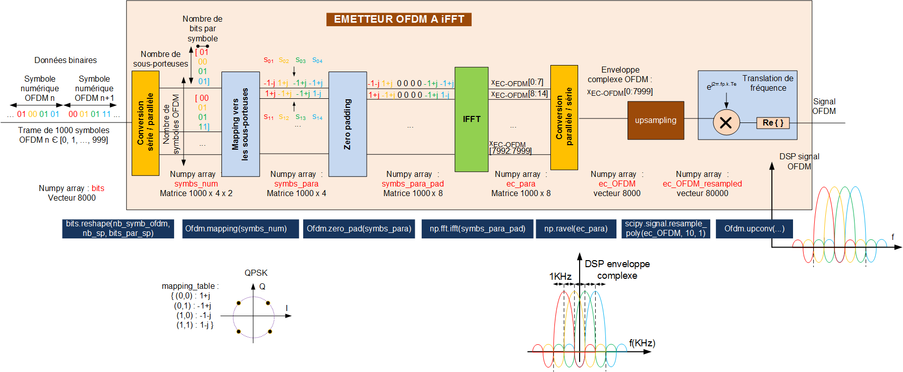
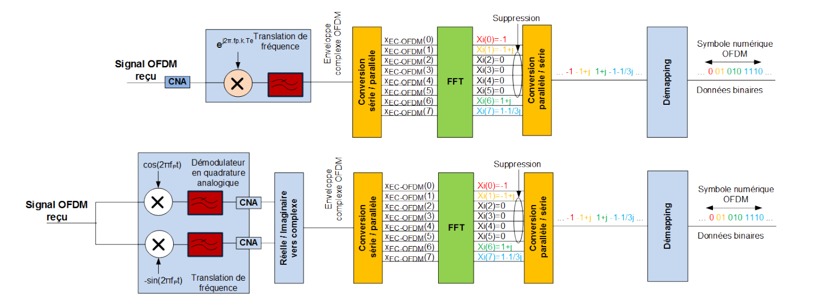

# OFDM Transmission

Série de travaux pratiques sur la transmission numérique OFDM, implémentés en Python avec Jupyter Notebook.

## Contenu

| Fichier | Description |
|---|---|
| `commNumv4.py` | Bibliothèque Python commune à tous les TPs |
| `TP 1 Filtrage adapté sujet.ipynb` | TP1 — Filtrage adapté |
| `TP 2 OFDM N modulateurs complexes v2 sujet.ipynb` | TP2 — Modulation OFDM par N modulateurs complexes |
| `TP 3 OFDM IFFT sujet.ipynb` | TP3 — Modulation OFDM par IFFT |
| `TP 4 Canal radio mobile préfixe cyclique et égalisation sujet.ipynb` | TP4 — Canal radio mobile, préfixe cyclique et égalisation |

## Bibliothèque `commNumv4.py`

Fournit les classes suivantes :

- **`Modem`** — Modulateur/démodulateur PAM/ASK (2, 4, 8), QPSK, 16-QAM. Gère le mapping, le filtrage (rectangulaire, cosinus surélevé), l'upconversion/downconversion et la détection.
- **`Ofdm`** — Modem OFDM à N modulateurs complexes ou par IFFT. Gère le mapping parallèle, le zero-padding, la conversion série/parallèle et la démodulation.
- **`Canal`** — Modèle de canal AWGN.
- **`Mesure`** — Outils de visualisation : DSP (mono/bilatérale, moyennée), diagramme de constellation, diagramme de l'œil.
- **`Source`** — Génération de bits aléatoires et de trames ICMP (via Scapy).

## Architecture

**Émetteur OFDM (N modulateurs complexes)**



**Émetteur / Récepteur OFDM (IFFT/FFT)**




## Dépendances

```
numpy
scipy
matplotlib
scapy
jupyter
```
